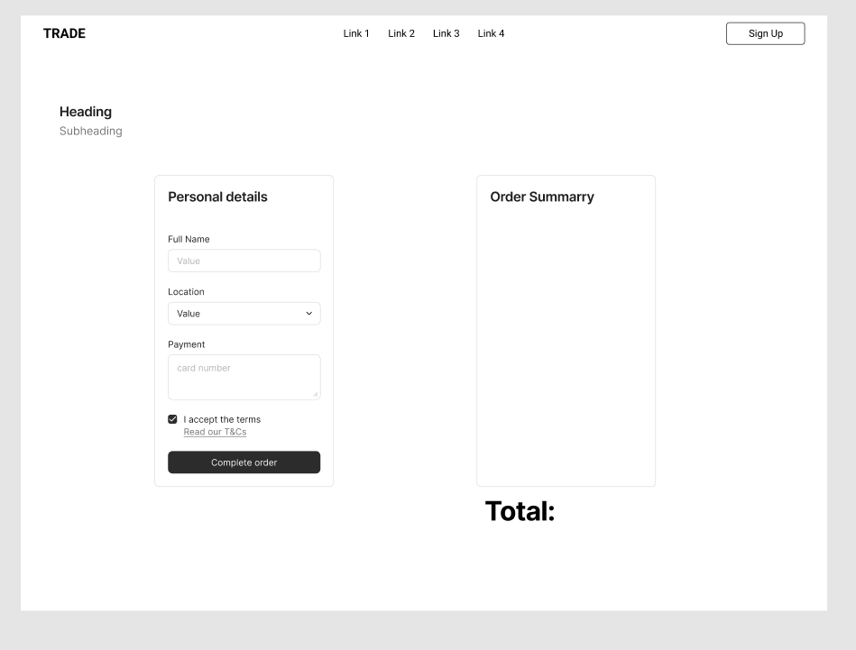

# FitTrack App

## Overview

The FitTrack App is a user-friendly platform designed to support individuals in their fitness journeys. It provides tools to browse fitness products, subscribe to plans, access exercise guides, and engage with a fitness-focused community. With features like order tracking, workout downloads, and a user-centric community space, the app aims to simplify fitness management.

---

## Design

### Colour Scheme
The website features a clean and vibrant design:
- Primary colors: **#333333**, **#ff9900** and **#cc7a00**.
- Most pages have a white background to ensure readability.
- Text uses the browser's default color for simplicity and accessibility.
- The color scheme remains consistent across all pages.

### Typography
- The app uses Open sans font-family for all text, ensuring compatibility and simplicity.

---

## Features

### General Features
All pages in the app include:
- **Favicon**: A recognizable icon that represents the app.
- **Navbar**: A responsive navigation bar that collapses into a burger menu on mobile and tablet devices for easy access.
- **Footer**: Contains links to the app’s social media accounts.

---

## Wireframes

### 1. Homepage Wireframe
This wireframe represents the layout for the homepage.

### 2. Product Page Wireframe
Here is the wireframe for the product page where users can browse and select products.

### 3. Product detail Page Wireframe
Here is the wireframe for the product detail page where users can select sizes and quantity of the products.

### 4. Community Page Wireframe
The community page provides all the post from all the communities.

### 5. Post detail Page Wireframe
The post detail page provides a space for users to connect, share tips, and ask questions.

### 6. Excercise Plan Page Wireframe
The Excercise Plan page provides a description of all the plan and download option.

### 7. Plan Page Wireframe
The Plan Page provides a list of the plan available for user to choose and subscribe.

### 8. Profile Page Wireframe
The Profile Page provides a space for users update their details and have order history all purchases user has made.

### 9. Bag Page Wireframe
The Bag Page provides an overview of all the product/plan user want to purchase.

### 10. Checkout Page Wireframe
The Checkout Page provides all the billing and shipping details from user and make a safe transactions.

### 11. Checkout Success Page Wireframe
The Checkout Success Page provides order summary.

---

### Page-Specific Features

## Home (Index) Page

The Home page serves as the starting point for users to explore the Fitness App. It includes a hero section, feature highlights, and a call-to-action (CTA) section.

### Features

1. **Hero Section**:
   - A welcoming section with a headline encouraging users to begin their fitness journey.
   - Includes a short description and two primary buttons:
     - **Explore Plans**: Links to the exercise plan list page.
     - **Community**: Links to the community list page.

2. **Features Section**:
   - Highlights three key benefits of the app:
     - **Exercise Plans**: Tailored workout routines for user-specific fitness goals.
     - **Nutrition Guidance**: Personalized meal plans to enhance performance.
     - **Community Support**: A platform to connect with fitness enthusiasts.

3. **Call-to-Action Section**:
   - A visually striking section prompting users to take action.
   - Includes a headline, motivational message, and a button to:
     - **Shop Now**: Links to the product page.

### Design Highlights

- **Responsive Layout**:
  - All sections are fully responsive, adapting seamlessly to different screen sizes (mobile, tablet, desktop).
- **Consistent Styling**:
  - Primary and secondary buttons follow a consistent color scheme:
    - **Primary Button**: Blue (`btn-primary`) for key actions.
    - **Secondary Button**: Outline style (`btn-outline-secondary`) for auxiliary actions.
- **Accessible Icons**:
  - Icons used in the Features Section are large and easily identifiable.

---

## Product Page

The Product Page provides users with a comprehensive view of all available products, including their details and sorting/filtering options.

### Features

1. **Navbar with Sorting and Filtering Options**:
   - Includes dropdown menus for enhanced navigation:
     - **Sort By**:
       - Price: Low to High
       - Price: High to Low
       - Rating: High to Low
       - Rating: Low to High
     - **Categories**:
       - Equipment
       - Nutrition
       - Merchandise
       - All Products (Default View)
     - **Wishlist**:
       - A direct link to the user's wishlist for quick access.

2. **Product Cards**:
   - Each product is displayed in a responsive card layout with:
     - **Image**:
       - Primary product image or a default placeholder image.
     - **Name**: Product title prominently displayed.
     - **Price**: Clearly visible pricing information.
     - **Description**: A short truncated overview of the product.
     - **Rating** (if available): Displays the product's rating out of 5.
     - **View Details Button**: Links to the detailed product page.

3. **Dynamic Content**:
   - Products are dynamically loaded and displayed using Django's template engine.
   - Filters and sorting options dynamically update the product list based on user selection.

4. **Responsive Design**:
   - The page is fully responsive, ensuring an optimal viewing experience across devices (mobile, tablet, desktop).

### Design Highlights

- **Card Layout**:
  - A clean and organized card-based design to ensure readability and aesthetic appeal.
- **Dropdown Menus**:
  - Intuitive and easy-to-use dropdowns for sorting and filtering products.
- **Visual Feedback**:
  - Highlighted images, clear buttons, and consistent text styles for better user interaction.

### Known Issue

- **Navbar Sorting**
  - **Sort By**:
      - Price: Low to High
      - Price: High to Low
      - Rating: High to Low
      - Rating: Low to High

- **Not working as expected**

### Future Features

- Debug the known issue mention above.
- Introduce user reviews and detailed ratings on the product cards.
- Implement a "Quick Add to Bag" button directly on the product cards.
- Add a search bar to enable direct searches by product name or category.
- Introduce a product form to enable adding products to the product page.
      
---

## Product Detail Page

The Product Detail Page provides an in-depth view of individual products, including options for selecting sizes, adjusting quantity, adding to the bag, and adding to the wishlist.

### Features

#### 1. **Product Image Section**
- Displays the product image in high resolution.
- Clicking on the image opens it in a new tab.
- A default placeholder image is displayed if no product image is available.

#### 2. **Product Details Section**
- **Name**: The product's name is displayed.
- **SKU**: The product's SKU (Stock Keeping Unit) is shown for reference.
- **Price**: Clearly visible pricing information.
- **Description**: Detailed description of the product.
- **Rating**: Displays the product's average rating or indicates "Not Rated" if no ratings are available.

#### 3. **Wishlist Functionality**
- A button allows users to add/remove the product from their wishlist.
  - Displays a filled heart icon when the product is wishlisted.
  - Displays an outlined heart icon for products not in the wishlist.

#### 4. **Add to Bag Functionality**
- Users can add the product to their shopping bag with the following options:
  - **Size Selector**: Dropdown menu for products that come in various sizes (e.g., XS, S, M, L, XL).
  - **Quantity Selector**: 
    - Includes "+" and "-" buttons to increment or decrement the quantity.
    - Allows manual input for quantities within a specified range (1–99).
- A form submission adds the selected product to the user's bag.

#### 5. **Action Buttons**
- **Keep Shopping**: A button that redirects users back to the product listing page.
- **Add to Bag**: Adds the product to the shopping bag with selected options.

#### 6. **Responsiveness**
- Fully responsive design for mobile, tablet, and desktop views.
- Ensures seamless user experience across devices.

### Design Highlights
- **Dynamic Content**:
  - Information such as images, sizes, ratings, and descriptions are dynamically fetched and displayed.
- **Interactive Elements**:
  - Quantity increment/decrement buttons.
  - Conditional rendering for wishlist status.
- **Accessible Forms**:
  - Forms are designed with CSRF protection and hidden redirect fields for secure and seamless processing.

### Known Issue
- Cannot choose the same product with different sizes

### Future Features

- Debug the known issue mention above.
- Add the ability to display customer reviews and ratings directly on the page.
- Include a "related products" section to suggest similar or complementary products.
- Enhance the wishlist button to show a success toast or notification upon adding/removing items.

---

## Wishlist Page

The **Wishlist Page** enables users to save their favorite products for later. This feature enhances the shopping experience and boosts user engagement.

## Features

### 1. Display Wishlist Items
- **Product Details**:
  - Product name (linked to the product detail page).
  - Product rating (if available) or a fallback message for unrated items.
  - Product price for quick reference.
- **Product Image**:
  - Displays the product image if available.
  - Uses a default "no image available" placeholder for items without an image.

### 2. Remove Items
- Each product in the wishlist includes a **Remove** button, allowing users to delete items with a single click.

### 3. Empty Wishlist State
- If the wishlist is empty, a friendly message ("Your wishlist is empty") is displayed.

### 4. Navigation
- **Back to Shopping** button redirects users to the product page, encouraging further exploration.

## Design Highlights

### 1. Responsive Layout
- Optimized for all screen sizes:
  - Columns adjust seamlessly for images, product details, and the remove button.
  - Provides an excellent user experience on mobile, tablet, and desktop devices.

### 2. Accessibility
- Semantic HTML ensures compatibility with screen readers.
- Buttons and links include descriptive text for improved navigation.

### 3. Styling
- Custom CSS ensures the page aligns with the site's overall theme and design.
- Consistent button and link styles maintain visual harmony.

### Known Issue
- When the product has been added/removed from the whislist view, instead of showing just the toast message it also shows the bag items(if the items are in the bag).  

## Future Features

- Debug the known issue mention above.
- **Bulk Management**: Add options to remove multiple items or clear the wishlist entirely.
- **Save for Later**: Allow users to move items between their wishlist and shopping bag.
- **Sharing Features**: Enable users to share their wishlist via email or social media.
- **Stock Alerts**: Notify users about price drops, sales, or stock changes for wishlist items.
- **Persistent Wishlist**: Save wishlist items to user profiles for logged-in users.

---

## Exercise Plans Page

The Exercise Plans Page displays a list of exercise plans available to users based on their subscription level.

## Features

### 1. **Dynamic Exercise Plan Listing**
- Exercise plans are presented in a **card layout**, with each card containing:
  - **Title**: Name of the exercise plan.
  - **Description**: Short description displayed by default, with an option to expand to the full description.
  - **Download Button**: Allows users to download the plan file if within their subscription limit.

### 2. **"Learn More" Toggle**
- Users can toggle between a **short** and **full** description:
  - A `Learn More` button expands the content to show the full description.
  - Once expanded, the button changes to `Learn Less` for toggling back.

### 3. **Download Limit Enforcement**
- Users can only download up to the **max_plans** allowed by their subscription:
  - If the user exceeds the limit, the card displays a **"You have reached your download limit"** message instead of the download button.

### 4. **Fallback for Empty Plans**
- If no plans are available, the page displays a user-friendly message:
  - Offers a button to redirect users to the **Plan List Page** to explore available plans.

## Design Highlights

### **Responsive Layout**
- Designed to work seamlessly across devices:
  - **Desktop**: Displays up to 3 cards per row.
  - **Tablet/Mobile**: Dynamically adjusts to 1–2 cards per row for readability.

### **Interactive User Experience**
- The **Learn More / Learn Less** feature improves usability with toggling descriptions.
- **jQuery Script** handles smooth toggling of content and updates button text dynamically.

### **Custom Styling**
- Custom CSS classes (`custom-card`, etc.) enhance the visual appeal with shadow effects and border styling.

## JavaScript Functionality

### Description Toggle Script
- Utilizes **jQuery** to toggle between short and full descriptions:
  - Adds or removes the `d-none` class to switch visibility.
  - Updates button text dynamically based on the description state.

## Future Enhancements
- Add filters or sorting options for plans (e.g., by duration or difficulty).
- Implement plan previews (e.g., small snippets or images).
- Display user progress or statistics based on downloaded plans.
- Integrate user ratings and reviews for each plan.

---

## Plan list page

The Plan list Page showcases all the available subscription plans, allowing users to view plan details and subscribe directly.

## Features

### 1. **Subscription Plans Listing**
- Displays subscription plans in a **card layout** for clarity and easy navigation.
- Each card includes the following details:
  - **Name**: Title of the subscription plan.
  - **Description**: Brief overview of the plan.
  - **Price**: Cost of the subscription in USD.
  - **Duration**: Duration of the plan in days (e.g. 7, 30).
  - **Features**: Key features or benefits of the subscription plan.

### 2. **Subscription Action**
- Users can subscribe to a plan directly from the page using the **Subscribe** button:
  - Clicking the button sends a POST request to add the selected plan to the user's shopping bag.
  - Includes CSRF protection for secure transactions.
  - Redirects users back to the plans list after subscription.

### 3. **Responsive Design**
- The layout adjusts seamlessly for various screen sizes, including:
  - **Desktop**: Displays multiple cards in a grid format.
  - **Tablet and Mobile**: Adjusts to show one or two cards per row for better readability.

### 4. **Interactive Design**
- Cards feature a clean, shadowed design to enhance visual appeal.
- Buttons are styled with Bootstrap for consistent UI.

## Design Highlights
- **Dynamic Content**: Plan data is dynamically fetched and rendered using Django templating.
- **Reusable Layout**: The card design can be extended for other listings (e.g., offers or promotions).
- **Form Integration**: Includes hidden redirect fields to ensure seamless navigation post-subscription.

---

## Community List Page

The **Community Page** is a central hub for users to explore and engage with various posts, which can be filtered by categories. This page is designed to allow users to easily navigate posts, view post details, and interact with content based on their interests.

## Features

### 1. **Categories Section**
- **Category Dropdown**: Users can filter posts by selecting a category from a dropdown menu.
  - **Dynamic Categories**: Categories are fetched dynamically from the backend to ensure that the list is always up-to-date.
  - **Category Links**: Clicking on a category name filters posts by the selected category.

### 2. **Post Listings Section**
- **Post Titles**: Each post’s title is displayed as a clickable link that redirects the user to the post’s detail page.
- **Post Metadata**:
  - **Author**: The name of the author who created the post is displayed.
  - **Creation Date**: Displays the date the post was created.
  - **Category**: The category of the post is displayed, which links back to filter posts by that category.

### 3. **Dynamic Content**
- **Category Filtering**: The list of posts dynamically updates when a category is selected, providing users with the ability to view posts related to their interests.

### 4. **Actionable Buttons**
- **Post Detail Button**: Clicking on the post title takes the user to the individual post’s detail page, where they can read the full content.
- **Category Filter Button**: The category dropdown allows users to filter posts based on selected categories, narrowing down the content they wish to explore.

### 5. **Responsiveness**
- **Mobile-First Design**: The page is designed to be fully responsive, ensuring that it provides a seamless experience on mobile, tablet, and desktop devices.
- **Grid Layout**: Post cards are organized in a grid layout that adjusts dynamically depending on the screen size.

## Design Highlights

- **Interactive Elements**: 
  - **Category Dropdown**: Users can interactively filter posts based on categories using the dropdown.
  - **Post Cards**: Each post is presented as a card, which makes the layout clean, attractive, and user-friendly.
- **Dynamic Loading**: Categories and posts are loaded dynamically to keep content up to date.

## Future Features

- **User Interaction**: Add features like liking, sharing on posts to encourage more engagement from the community.
- **Search Functionality**: Introduce a search bar to allow users to search posts by keywords or titles.
- **User Post**: Users will be able to post their content under the category they choose.

---

## Post Detail Page

The **Post Detail Page** allows users to view the full content of a post, including the author's details, post content, and comments. Users can interact with the post by adding, editing, and deleting comments, with options to edit or delete comments available for the comment author or administrators.

## Features

### 1. **Post Details Section**
- **Title**: The post's title is displayed at the top, and easily readable.
- **Author and Date**: The name of the post author and the date the post was created are displayed below the title for context.
- **Post Content**: The full content of the post is shown using **Django summernote**.

### 2. **Comments Section**
- **Comment Display**: All comments associated with the post are displayed below the main post content.
  - **Comment Author**: The username of the comment's author is displayed prominently.
  - **Comment Content**: The comment's content is shown below the author's name.
  - **Timestamp**: The creation date of each comment is displayed below the comment content.
- **Empty Comments State**: If there are no comments yet, a message is shown prompting users to be the first to comment.

### 3. **Comment Management (Edit/Delete)**
- **Edit Comment**: The author of a comment can edit their comment using a form that allows them to update the content of their comment. The form is displayed next to the comment if the logged-in user is the author of that comment.
- **Delete Comment**: Both the comment author and administrators (superusers) can delete comments. A delete button appears next to the comment for these users, allowing them to remove the comment from the post.

### 4. **Add a Comment**
- **Comment Form**: At the bottom of the page, users can add a new comment. A simple form captures the content of the comment, and users can submit it to be added to the post.
  - The form uses **CSRF protection** to secure submissions.
  - The **Crispy Forms** library is used to render the form fields, ensuring a clean and styled input experience.

### 5. **Responsiveness**
- **Mobile-First Design**: The page is responsive and adjusts to different screen sizes, ensuring a seamless user experience on mobile, tablet, and desktop devices.
- **Card Layout**: Posts and comments are presented in **Bootstrap** cards, making the layout clean and structured across devices.

## Design Highlights

- **Dynamic Content**: The page dynamically displays the post content, comments, and comment forms based on user interactions.
- **Interactive Comment Features**:
  - **Editing**: Comments can be updated by the author.
  - **Deleting**: Comments can be deleted by their author or a superuser.
  - **Adding**: New comments can be added by any logged-in user.
- **Crispy Forms**: The comment form is styled using **Crispy Forms** for an elegant, responsive UI.

## Future Features

- **Like/Dislike Post**: Add the ability for users to like or dislike Post to increase engagement.
- **Like/Dislike Comments**: Add the ability for users to like or dislike comments to increase engagement.
- **Nested Comments**: Implement nested comment functionality to allow replies to existing comments.
- **Comment Moderation**: Introduce comment moderation features for administrators, including the ability to approve, reject, or report comments.

---

## Profile Page

The **Profile Page** allows users to view and update their profile information, as well as view their order history. This page is designed for a seamless user experience with a simple interface to update personal details and view past purchases.

## Features

### 1. **Profile Update Section**
- **Profile Form**: The user can update their profile information using a form. The form is rendered using **Crispy Forms**, ensuring an elegant layout.
  - **Form Fields**: Users can update fields such as name, email, password, and any other personal information.
  - **CSRF Protection**: The form includes CSRF protection to ensure security during form submissions.
  - **Save Changes**: After editing, the user can click the **Save Changes** button to submit the updated information.

### 2. **Order History Section**
- **Order List**: Displays a table of past orders made by the user.
  - **Order Number**: Each order is listed with a clickable link to view the details of the order.
  - **Order Date**: The date when the order was placed is displayed.
  - **Order Items**: The list of items in each order, including product names and quantities. If the product has sizes, the size is shown next to the product name.
  - **Order Total**: The total cost of the order is displayed for each order.
- **No Orders Message**: If the user hasn't made any purchases yet, a message is displayed indicating that no orders are available.

### 3. **Responsive Design**
- The page is designed to be fully responsive, ensuring that users have a seamless experience across mobile, tablet, and desktop devices.
- The layout uses **Bootstrap's grid system** to ensure proper alignment and responsiveness for various screen sizes.

### 4. **JavaScript Integration**
- **Custom JavaScript**: A custom script is included to handle form interactive behaviors on the profile page.

## Design Highlights

- **Profile Update Form**:
  - Uses **Crispy Forms** for clean form rendering.
  - Simple interface for users to update their personal details.
- **Order History Table**:
  - A clear and organized table layout for displaying order information.
  - Includes product details with quantities and sizes for a detailed view of past purchases.
  - Dynamic content rendering ensures the user sees their actual order history.

## Future Features

- **Order Details Page**: Add functionality to view more detailed information about each order, including shipping address and payment method.
- **Profile Picture Upload**: Allow users to upload a profile picture.
- **Order Tracking**: Implement order tracking information so users can see the status of their orders.
- **Plan Tracking**: Implement plan tracking informations so users can see the status of their plan.

---

## Bag Page

The **Bag Page** provides users with a view of the items they have added to their shopping cart. Users can adjust quantities, remove items, and proceed to checkout. It also displays an order summary, including the subtotal, delivery charges, and the grand total.

## Features

### 1. **Empty Bag State**
- If the shopping bag is empty, a message is displayed: **"Your shopping bag is empty."**
- A button is provided to redirect users to continue shopping: **Continue Shopping**.

### 2. **Bag Item Listing**
- **Product Image**: Displays the image of the product in the shopping bag.
  - If the product doesn’t have an image, a placeholder image is shown.
- **Item Name**: The name of the product or plan is displayed.
- **Size**: If applicable, the size of the product is displayed. If the product does not have sizes, **N/A** is shown.
- **Quantity**: Users can update the quantity of the product with a custom input field. There are also **"+"** and **"-"** buttons to increment or decrement the quantity.
  - The form allows users to update the quantity of each item.
- **Price**: Displays the unit price of the product.
- **Total**: Shows the total price for that item, calculated by multiplying the unit price with the quantity.
- **Remove Item**: A **Remove** button is provided to remove the item from the shopping bag.

### 3. **Order Summary**
- **Subtotal**: Displays the total price of all the items in the bag.
- **Delivery Charges**: Shows delivery charges. If the delivery is free, it displays "Free".
- **Free Delivery Eligibility**: If the user is eligible for free delivery based on their current total, a message is displayed with the remaining amount required to qualify for free delivery.
- **Grand Total**: Displays the final total, including the subtotal and delivery charges.

### 4. **Action Buttons**
- **Continue Shopping**: A button that redirects users back to the product page to add more items to the bag.
- **Proceed to Checkout**: A button that takes the user to the checkout page to complete the purchase.

### 5. **Responsive Design**
- Fully responsive design, ensuring that the bag page is usable on all screen sizes (desktop, tablet, and mobile).
- Uses **Bootstrap** for layout and responsiveness.

### 6. **JavaScript Integration**
- **Quantity Management**: Custom JavaScript is included to handle the **"+"** and **"-"** buttons for changing quantities, as well as validating input quantities within the allowed range (1–99).
- **Dynamic Updates**: The page is updated dynamically with the quantity changes and recalculated totals when items are added, removed, or updated.

## Design Highlights

- **Clean and Intuitive Layout**:
  - The shopping bag page is laid out with a table displaying the product details clearly for each item.
  - Users can easily view their order summary and proceed to checkout.
  
- **Interactive Quantity Input**:
  - **Increment and decrement** buttons make it easier for users to modify the number of items they wish to purchase.
  - Users can also input the desired quantity manually.

- **Order Summary**:
  - Displays the total cost breakdown (subtotal, delivery, and grand total) so users can easily review their order before checkout.

- **Customizable Item Removal**:
  - Each item has a **Remove** button, allowing users to easily remove unwanted items from their shopping bag.

## Future Features

- **Coupon Code Integration**: Add functionality to apply discount coupons to the shopping bag.
- **Save for Later**: Allow users to save items in the shopping bag for later purchase without removing them.
- **Wishlist Integration**: Enable users to add items to their wishlist from the shopping bag.

---

## Checkout Page

The **Checkout Page** is the final step in the shopping process, where users can review their order and provide their personal, delivery, and payment details. It integrates with Stripe to securely handle payments and ensures a seamless and easy checkout process for users.

## Features

### 1. **Order Summary Section**
- **Products Overview**: Displays each item in the shopping bag, including product name, quantity, and price.
  - If the item has an image, it is shown alongside the product name and quantity. If no image is available, a placeholder image is used.
  - For plans (non-product items), the plan name and details are shown instead of product-specific fields.
- **Order Total**: The total cost of all items in the cart is calculated and displayed.
- **Delivery Charges**: Shows the delivery charge. If there is a fixed fee or discount, it is reflected here.
- **Grand Total**: The final amount, which includes both the product total and the delivery charge.

### 2. **Checkout Form**
- **Personal Details**: Users are required to provide their full name and email address. The form fields are rendered using **Django forms** and **crispy-forms** for a clean and structured layout.
- **Delivery Details**: Users enter their phone number, street address, town/city, county, postcode, and country.
  - An option is provided to save the delivery information to the user's profile if they are logged in.
  - If the user is not logged in, they are prompted to either log in or create an account.
  
### 3. **Payment Section**
- **Stripe Integration**: Uses the **Stripe Elements** library to securely collect and process card information.
  
### 4. **Action Buttons**
- **Adjust Bag**: A button that takes the user back to their shopping bag, allowing them to modify their order before proceeding with checkout.
- **Complete Order**: A button to submit the checkout form and complete the order. When clicked, the payment process is initiated via Stripe.

### 5. **Loading Overlay**
- A loading overlay with a spinning icon appears while the payment is being processed. This enhances the user experience by providing feedback during the transaction.

### 6. **Responsive Design**
- Fully responsive layout to ensure that users can complete the checkout process on both desktop and mobile devices.
- The checkout form is designed to be clear and easy to navigate on various screen sizes.

### 7. **Additional Features**
- **Payment Confirmation**: After a successful payment, users are redirected to a confirmation page, providing them with an order summary and thanking them for their purchase.

## Design Highlights

- **Structured Checkout Process**: The page is divided into two main sections: the order summary on the left and the checkout form on the right. This makes the page easy to navigate.
- **Clear Action Buttons**: The **Complete Order** and **Adjust Bag** buttons are prominently displayed, guiding users through the process.
- **Responsive & User-Friendly**: The form fields are designed for ease of use, and the layout adapts to various screen sizes for mobile, tablet, and desktop views.

## Future Enhancements

- **Discount Codes**: Integrate discount or promo codes to be applied during checkout.
- **Multiple Payment Methods**: Consider adding alternative payment methods (e.g., PayPal, Apple Pay) for additional flexibility.
- **Plan subscription integration**: Instead of purchasing the plan through the bag, a plan subscription method will apply.

---

## Checkout Success Page

The **Checkout Success Page** is displayed to the user after a successful order completion. It confirms that the user's order has been processed and provides details of the order, including the order number, delivery details, and a summary of the purchased items. It is designed to give the user a clear view of their order and ensure they have all the necessary information after making a purchase.

## Features

### 1. **Thank You Section**
- **Order Confirmation**: A confirmation message thanking the user for their order.
  - Displays the **order number**, which is generated for each unique order.
  - A confirmation email is sent to the provided email address, and users are encouraged to keep it for their records.
- **Continue Shopping**: A button that allows users to return to the product page and continue shopping.

### 2. **Order Summary Section**
- **Order Total**: Displays the total cost of all items in the user's bag.
- **Delivery Charges**: Shows the delivery cost.
- **Grand Total**: The final amount, which includes both the total for products, plan and the delivery charge.

### 3. **Delivery Details Section**
- **User Information**: Displays the details provided by the user for delivery.
- **Conditional Fields**: Address and contact fields are displayed based on availability, such as county and postcode being optional.

### 4. **Design and Layout**
- **Clear Structure**: The page is divided into two main sections:
  - **Thank You Section** (order confirmation and email info)
  - **Order Summary Section** (order total, delivery charge, and grand total)
  - **Delivery Details Section** (user’s delivery information)
- **Responsive Layout**: The page is fully responsive, adapting to both desktop and mobile views for a seamless user experience across devices.

### 5. **Action Buttons**
- **Continue Shopping**: A button that redirects users to the product page, allowing them to browse and shop further.

## Design Highlights

- **Structured Layout**: The content is organized into logical sections (Thank You, Order Summary, Delivery Details) to enhance user experience.
- **Clear Action Buttons**: The **Continue Shopping** button is prominently displayed, guiding the user back to the product page after confirming their order.
- **User-Friendly**: The layout ensures clarity in displaying order and delivery details for easy reading.

## **Authentication Pages**
- **Django all-auth**:
  - **Sign Up**: Allows users to register for an account.
  - **Login**: Provides secure access to accounts.
  - **Logout**: Safely ends the user session.

---

## Marketing

### Target Audience:
  - Fitness Enthusiasts: People who are already into fitness and want personalized fitness plans.
  - Beginners: People who want to start a fitness journey but are unsure where to begin.
  - Busy Professionals: People looking for a convenient way to track fitness without spending too much time.
  - Health-conscious Individuals: People focused on maintaining a healthy lifestyle.

### Value Proposition & Key Features
  - Personalized Fitness Plans: Tailored plans to fit individual needs based on goals, fitness level, and preferences.
  - Community Engagement: Connect with like-minded individuals in the community to share tips, motivate each other, and celebrate milestones.
  - User-Friendly Interface: Simple and intuitive design that makes tracking progress easy.
  - Access Anytime, Anywhere: Users can access their plans and progress tracking wherever they are.

### Content Marketing
  - Fitness Blog: Start a blog about fitness, health, and wellness. Create articles that promote FitTrack by subtly introducing the app as a solution to common fitness challenges.
  - Blog post ideas: "How to Stay Consistent with Your Fitness Goals," "Top 5 Apps Every Fitness Enthusiast Needs," and "How to Create a Personalized Workout Plan with FitTrack."
  - Video Tutorials: Create YouTube or Instagram tutorials showing how FitTrack works. Include real-time examples of users signing up, selecting plans, and tracking progress.
  - User Stories: Share real-life user success stories. People love seeing transformations, and showing how FitTrack helped someone achieve their fitness goals could encourage new users.

### Referral Program
  - Launch a referral program where existing users can get rewards for bringing in new users. For instance:
    - Offer premium features for free for a limited time when someone signs up using a referral link.
    - Give discounts on future plans or exclusive content.

### Partnerships & Sponsorships
  - Partner with gyms, fitness trainers, or health organizations to promote FitTrack. Offer gym members or clients free trials of FitTrack in exchange for promoting it.
  - Sponsorship of fitness events: We can sponsor local or virtual fitness events (e.g., marathons, wellness workshops, fitness challenges) to get exposure and promote FitTrack.

### Google Ads & SEO
  - Google Ads: Use Google Ads to target people searching for fitness apps, workout plans, or fitness tracking tools.
  - Keywords to target: fitness, health, exercise, nutrition, community, finess poducts
  - Search Engine Optimization (SEO): Elevate your fitness journey with FitTrack - personalized plans, vibrant community, and exclusive shop.
  - Sitemap.xml: Helps SEO to discover URLS, UPDATE CONTENT, improve USER EXPERIENCE
  - Robot.txt: Help manage SEO crawls website

### Social Media Business page 
  - [Facebook pages](https://www.facebook.com/profile.php?id=61571039735120)
  - 
  - 
  - 
  - 

### Newsletter Marketing with Mailchimp
  - Mail Chimp newsletter
  - 

---

## Manual Testing

### Responsiveness

Each page has been inspected on variety of devices such as mobile, laptop, desktop. Moreover, they have been tested on multiple browser such as Google, Microsoft edge.

---

## AUTOMATED TESTING
- Each app have test views and test forms.

---

#### Frameworks, Libraries & Programs Used

- [Favicon.io](https://favicon.io/) - To create and download the favicon logo.
- [Flaticon](https://www.flaticon.com/) - To download the favicon png logo.
- [Bootstrap 4](https://getbootstrap.com/) - To make templates responsive and add css.
- [Google Dev tools](https://developer.chrome.com/docs/) - to troubleshoot and test issues during the development.
- [MDN webdocs](https://developer.mozilla.org/en-US/) - reference
- [W3C schools](https://www.w3schools.com/) - for resolving code format in CSS and HTML.
- [Color Hunt](https://colorhunt.co/) - for choosing the color palettes.
- [Pinterest](https://uk.pinterest.com/) - All products images.
- [Mitsology](https://mitsology.com/debunking-common-myths-and-misconceptions-about-health-and-fitness/) - For Facebook cover page
- [Stack Overflow](https://stackoverflow.com/) - For queries and trouble shooting
- [Django](https://www.djangoproject.com/) - Documentation and trouble shooting
- [Python](https://www.python.org/) - Documentation and trouble shooting
- [Stripe](https://stripe.com/gb) - Payment intent
- [Amazon AWS](https://aws.amazon.com/) - Online storage
- [Font Awesome](https://fontawesome.com/) - Icons
- [Figma](https://www.figma.com/) - Designing wireframe

---

## Deployment

---
 This site was deployed using the following steps:

1. Open GitHub.
2. Select the project to be deployed.
3. Go to 'Settings'.
4. In the Code and Automation section, select Pages.
5. Set Source to 'Deploy from a branch'.
6. Select Main Branch.
7. Set Folder to 'Root'.
8. Under Branch click 'Save'
9. The link to the live website is now displayed at the top of the page.

### Local development

---

#### How to Fork

1. Log in to Github.
2. Go to the repository for this project.
3. At the top right of the page, click the "Fork" button. This will create a copy of the repository under your Github account.

#### How to clone

1. Log in to Github.
2. Go to the repository for this project.
3. Click on the "Code" button, select from HTTPS, SSH or Github CLI.
4. Copy the URL for the repository.
5. Open your terminal or command prompt.
6. Navigate to the directory where you want to clone your repository.
7. Use the `git clone` command followed by the URL that you have copied.
